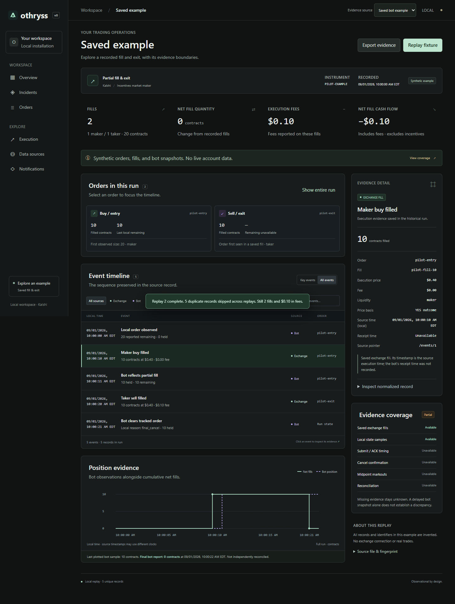

# Othryss

**Investigate what happened between your trading bot and the exchange.**

Othryss is a local, read-only Kalshi operations workspace. It records orders and fills, compares supported bot state with exchange evidence, and keeps incidents and their investigation history in one place.

**Status: early pilot.** Windows is the supported managed deployment. Python 3.11+ is required. The browser UI needs no Node installation. [Current features and limitations](docs/features.md).



## Try it without credentials

```powershell
git clone https://github.com/adamnhan/othryss.git
cd othryss
python -m othryss.server --port 8765
```

Open **http://127.0.0.1:8765/#example**. All example records are synthetic. Explore the fill timeline, inspect the evidence, or export it. Stop the example server with **Ctrl+C**. No exchange connection or additional Python packages are needed for this path.

## Connect a Kalshi account

```powershell
python -m venv .venv
.\.venv\Scripts\python.exe -m pip install -r requirements-pilot.txt
.\.venv\Scripts\python.exe -m othryss.onboarding init --account my-account --environment production
```

Use `demo` for a Kalshi demo key. Edit the generated `local.env` with a dedicated **read-only** key ID and the path to its separate private-key file:

```dotenv
OTHRYSS_KALSHI_KEY_ID=your-key-id
OTHRYSS_KALSHI_PRIVATE_KEY_PATH=C:/private/kalshi-read-only.pem
```

```powershell
.\.venv\Scripts\python.exe -m othryss.onboarding check
.\.venv\Scripts\python.exe -m othryss.ops start
.\.venv\Scripts\python.exe -m othryss.onboarding check --live
```

Open **http://127.0.0.1:8766**. Initial collection can take several cycles; rerun the live check once it completes. Start with **Overview**, then inspect an order in **Orders**. [Full onboarding guide](docs/onboarding.md).

## What it does

- Imports and deduplicates exchange orders/fills, with restart recovery and explicit freshness.
- Shows primary-subaccount balance, inventory, fill volume, and execution fees.
- Separates active and inactive orders, with searchable investigation timelines and evidence exports.
- Compares supported bot positions, orders, and fill IDs with independent exchange captures.
- Tracks sustained discrepancies through pending, open, acknowledged, and resolved incidents.
- Measures captured request/retry latency, cancellation/fill timing, and 1/5/30-second markout estimates when evidence permits.
- Delivers configured incidents to Discord or signed webhooks.
- Supervises local workers and provides verified backups and isolated restores.

## Boundaries

Kalshi only. Account overview and the supported LIP integration focus on primary subaccount 0. Other bot families need adapters. Exchange order/fill collection is polling, not a complete live lifecycle stream. Missing evidence stays unknown; timing estimates do not prove causality. There is no complete strategy P&L or trading enforcement.

The UI binds to loopback and has no remote authentication. Backups stay on this computer; history can grow. Hosted operation, team permissions, independent host-down alerting, and large-customer capacity validation are future work. Live validation so far covers one bot family with multiple probes; independent installations remain pilot work.

## Guides

- [Bot telemetry integration](docs/pilot-bot-integration.md)
- [Discord and generic webhooks](docs/alert-delivery.md)
- [Inventory limits through JSON/CLI](docs/account-risk-overview.md)
- [Service recovery, backup, and restore](docs/operations.md)
- [Order investigation](docs/order-investigation.md) and [execution analysis](docs/execution-analysis.md)
- [Pilot feedback form](FEEDBACK.md)

## Contribute

Start with [CONTRIBUTING.md](CONTRIBUTING.md). Bug reports and usability feedback are welcome through [GitHub Issues](https://github.com/adamnhan/othryss/issues). Review screenshots and exports for trading details before posting; never attach credentials or an installation directory. See [SECURITY.md](SECURITY.md) for security reports.

```powershell
python -m pip install -r requirements-reference.txt
python -m unittest discover -s tests -v
```

The [release workflow](docs/pilot-release.md) verifies a clean package and exercises onboarding with synthetic exchange responses. These checks do not place orders or send external alerts.

## License

[MIT](LICENSE).
